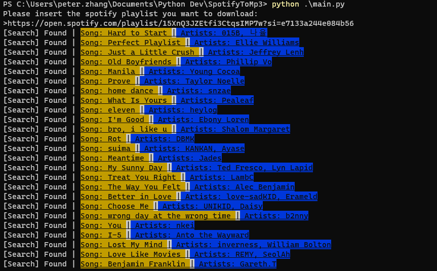
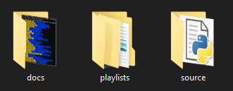
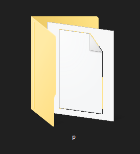
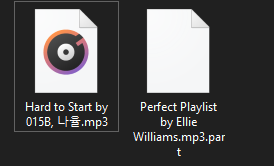

# SpotifyToMp3

Download spotify songs to mp3 files
with the help of youtube-dl!

## This is what you will see (not the greatest but it works :D)

This currently takes songs from my own personal playlist. Feel free to try and find it lmao :)

# How to use

The program basically asks you for everything you need so there should be nothing to worry about

Some things you should have:

- Internet connection
- Storage on your device
- A computer
- time i guess?

## Where do songs go?

You see this? These are folders located in the root of this git repo. What happens is the program creates the 'playlist' folder after you run main.py or the exe once. Very cool :)

As for songs, the program prompts you for the folder name. This is then used to create a folder where the songs are downloaded to!

In this example, I told the program to name my folder 'p' (why not)

And here we are, wish some songs that have been downloaded off spotify :)

# Warning

Spotify may pull off something in the future and then some constants will have to be changed within the codebase.
In `main.py`, the `SPOTIFY_SONGS_DIV` may have to be changed to suit the new div name!
